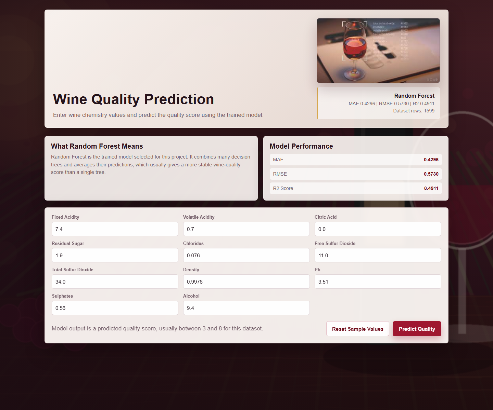

# 🍷 Wine Quality Prediction Model
<p align="center">
  
  
  
  
</p>
##🌐 Live Demo
https://wine-quality-prediction-model.onrender.com/

Machine learning project to predict wine quality scores from physicochemical features using Python and Scikit-learn.


## 🚀 Features
- Comprehensive Exploratory Data Analysis (EDA)
- Data Preprocessing and Feature Engineering
- Interactive Visualizations for Data Insights
- Machine Learning Model Development
- Wine Quality Classification and Prediction
- Model Performance Evaluation
- Scalable and Reproducible Workflow

## 🛠️ Tech Stack
- Python
- Pandas
- NumPy
- Matplotlib
- Seaborn
- Scikit-learn
- 
## 📈 Results
- Built a machine learning model for wine quality prediction.
- Achieved reliable predictions using physicochemical features.
- Evaluated model performance using Scikit-learn metrics.

## 👨‍💻 Author
Kundan Pandey
- GitHub: https://github.com/kundanmrj5-dev
- LinkedIn: https://www.linkedin.com/in/kundan-pandey-710185299
## 📂 Dataset
Information about the dataset.

## ⚙️ Installation
Steps to run the project.

## 📊 Results
Model performance and outcomes.

## 👨‍💻 Author
Kundan Pandey
## App Screenshot



## Project Overview

This project covers the full ML workflow:

- Exploratory data analysis with Pandas, Matplotlib, and Seaborn
- Data preprocessing and train/test splitting
- Model training with Scikit-learn pipelines
- Regression model evaluation using MAE, RMSE, and R2 score
- Feature importance visualization
- Saved model artifact for future predictions

## Tech Stack

- Python
- Pandas
- NumPy
- Matplotlib
- Seaborn
- Scikit-learn
- Joblib

## Folder Structure

```text
wine-quality-prediction/
├── assets/
│   ├── app-screenshot.png
│   ├── prediction-process.jpeg
│   └── wine-background.png
├── data/
│   └── README.md
├── models/
│   └── .gitkeep
├── notebooks/
│   └── README.md
├── outputs/
│   └── .gitkeep
├── src/
│   ├── __init__.py
│   ├── config.py
│   ├── data_utils.py
│   ├── eda.py
│   ├── predict.py
│   ├── train.py
│   └── web_app.py
├── Procfile
├── .gitignore
├── render.yaml
├── requirements.txt
└── README.md
```

## Dataset

Use the Wine Quality dataset from the UCI Machine Learning Repository.

Recommended file:

- `winequality-red.csv`

Place it here:

```text
data/winequality-red.csv
```

The CSV should contain a target column named `quality`.

Download the official red-wine dataset:

```bash
python src/download_data.py
```

If the dataset is not available, the project can generate a realistic sample dataset for demonstration:

```bash
python src/data_utils.py --create-sample
```

## Setup

Create and activate a virtual environment:

```bash
python -m venv .venv
.venv\Scripts\activate
```

Install dependencies:

```bash
pip install -r requirements.txt
```

## Run EDA

```bash
python src/eda.py
```

This creates plots in `outputs/`, including:

- target distribution
- correlation heatmap
- feature scatter plots

## Train Model

```bash
python src/train.py
```

This trains and compares:

- Linear Regression
- Random Forest Regressor
- Gradient Boosting Regressor

The best model is saved to:

```text
models/wine_quality_model.joblib
```

The model file is an active model bundle containing:

- trained Scikit-learn pipeline
- feature column order
- selected model name
- evaluation metrics
- dataset shape used during training

Evaluation results are saved to:

```text
outputs/metrics.csv
```

## Predict Wine Quality

After training, run:

```bash
python src/predict.py
```

## Use the Web Prediction Page

Start the local web app:

```bash
python src/web_app.py
```

Then open:

```text
http://127.0.0.1:8000
```

The web page includes:

- trained Random Forest model prediction
- wine-chemistry input form with sensible value ranges
- reset sample button for quick demos
- local visual assets for a polished portfolio UI
- `/health` endpoint for deployment checks

Or pass custom values:

```bash
python src/predict.py ^
  --fixed_acidity 7.4 ^
  --volatile_acidity 0.7 ^
  --citric_acid 0.0 ^
  --residual_sugar 1.9 ^
  --chlorides 0.076 ^
  --free_sulfur_dioxide 11 ^
  --total_sulfur_dioxide 34 ^
  --density 0.9978 ^
  --pH 3.51 ^
  --sulphates 0.56 ^
  --alcohol 9.4
```

## Deploy Publicly

The local URL only works on your computer:

```text
http://127.0.0.1:8000
```

For a public portfolio link, deploy the project as a Python web service on Render.

This project includes:

- `render.yaml`
- `Procfile`
- `/health` route
- support for Render's `PORT` environment variable

Render settings:

```text
Build Command: pip install -r requirements.txt
Start Command: python src/web_app.py --host 0.0.0.0
Health Check Path: /health
```

Deployment steps:

1. Push this repository to GitHub.
2. Open Render and create a new Web Service.
3. Connect the GitHub repository.
4. Use the build and start commands above.
5. Deploy and copy the generated `onrender.com` URL.

Render requires public web services to bind to `0.0.0.0` and use the provided port environment for incoming traffic. This app is already configured for that.

## Resume Description

Wine Quality Prediction - Machine Learning Project

- Developed a machine learning model to predict wine quality using Python and Scikit-learn.
- Performed EDA, data preprocessing, visualization, and model evaluation using Pandas, NumPy, Matplotlib, and Seaborn.
- Compared multiple regression algorithms and saved the best-performing model for future predictions.

Skills: Python, Pandas, NumPy, EDA, Data Preprocessing, Data Visualization, Matplotlib, Seaborn, Scikit-learn, Machine Learning, Model Evaluation.
